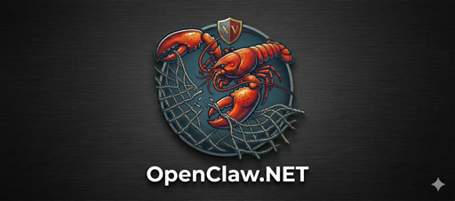
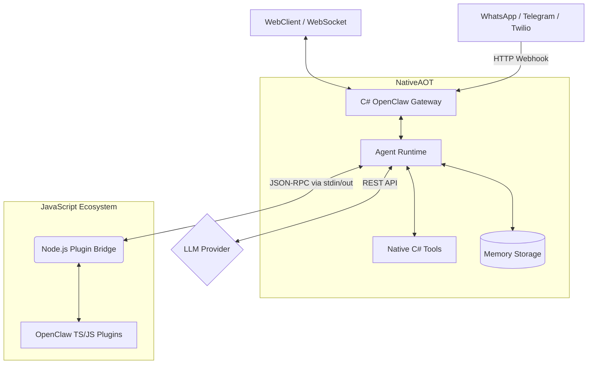

<div align="center">
  
</div>

# OpenClaw.NET

[](https://opensource.org/licenses/MIT)

> **Disclaimer**: This project is not affiliated with, endorsed by, or associated with [OpenClaw](https://github.com/openclaw/openclaw). It is an independent .NET implementation inspired by their excellent work.

Self-hosted OpenClaw.NET gateway + agent runtime in .NET (NativeAOT-friendly).

## Architecture

OpenClaw.NET uses a decoupled architecture to achieve NativeAOT performance while retaining full compatibility with the massive JavaScript plugin ecosystem.



## Docs

- [Tool Guide](TOOLS_GUIDE.md) — Detailed setup for all 18+ native tools.
- [User Guide](USER_GUIDE.md) — Core concepts and architecture.
- [Security Guide](SECURITY.md) — Mandatory reading for public deployments.

## Quickstart (local)

1. Set your API key:
   - `export MODEL_PROVIDER_KEY="..."`
   - *For advanced LLM provider setup (Ollama, Anthropic, Azure) see the [User Guide](USER_GUIDE.md).*
2. Run the gateway:
   - `dotnet run --project src/OpenClaw.Gateway -c Release`
   - Optional config file: `dotnet run --project src/OpenClaw.Gateway -c Release -- --config ~/.openclaw/config.json`
   - Doctor mode: `dotnet run --project src/OpenClaw.Gateway -c Release -- --doctor`
3. Connect a WebSocket client:
   - `ws://127.0.0.1:18789/ws`
4. (Optional) Use the CLI (OpenAI-compatible `/v1/chat/completions`):
   - `dotnet run --project src/OpenClaw.Cli -c Release -- run "summarize this README" --file ./README.md`
   - `dotnet run --project src/OpenClaw.Cli -c Release -- chat`

Environment variables for the CLI:
- `OPENCLAW_BASE_URL` (default `http://127.0.0.1:18789`)
- `OPENCLAW_AUTH_TOKEN` (only required when the gateway enforces auth)

## Companion app (Avalonia)

Run the cross-platform desktop companion:
- `dotnet run --project src/OpenClaw.Companion -c Release`

Notes:
- For non-loopback binds, set `OPENCLAW_AUTH_TOKEN` on the gateway and enter the same token in the companion app.
- If you enable “Remember”, the token is saved to `settings.json` under your OS application data directory.

## WebSocket protocol

The gateway supports **both**:

### Raw text (legacy)
- Client sends: raw UTF-8 text
- Server replies: raw UTF-8 text

### JSON envelope (opt-in)
If the client sends JSON shaped like this, the gateway replies with JSON:

Client → Server:
```json
{ "type": "user_message", "text": "hello", "messageId": "optional", "replyToMessageId": "optional" }
```

Server → Client:
```json
{ "type": "assistant_message", "text": "hi", "inReplyToMessageId": "optional" }
```

## Internet-ready deployment

### Authentication (required for non-loopback bind)
If `OpenClaw:BindAddress` is not loopback (e.g. `0.0.0.0`), you **must** set `OpenClaw:AuthToken` / `OPENCLAW_AUTH_TOKEN`.

Preferred client auth:
- `Authorization: Bearer <token>`

Optional legacy auth (disabled by default):
- `?token=<token>` when `OpenClaw:Security:AllowQueryStringToken=true`

Built-in WebChat auth behavior:
- The `/chat` UI connects to `/ws` using `?token=<token>` from the Auth Token field.
- For Internet-facing/non-loopback binds, set `OpenClaw:Security:AllowQueryStringToken=true` if you use the built-in WebChat.
- The token value is saved in browser `localStorage` as `openclaw_token` when entered.

### TLS
You can run TLS either:
- Behind a reverse proxy (recommended): nginx / Caddy / Cloudflare, forwarding to `http://127.0.0.1:18789`
- Directly in Kestrel: configure HTTPS endpoints/certs via standard ASP.NET Core configuration

If you enable `OpenClaw:Security:TrustForwardedHeaders=true`, set `OpenClaw:Security:KnownProxies` to the IPs of your reverse proxies.

### Hardened public-bind defaults
When binding to a non-loopback address, the gateway **refuses to start** unless you explicitly harden (or opt in to) the most dangerous settings:
- Wildcard tooling roots (`AllowedReadRoots=["*"]`, `AllowedWriteRoots=["*"]`)
- `OpenClaw:Tooling:AllowShell=true`
- `OpenClaw:Plugins:Enabled=true` (JS plugin bridge)
- `raw:` secret refs (to reduce accidental secret commits)

To override (not recommended), set:
- `OpenClaw:Security:AllowUnsafeToolingOnPublicBind=true`
- `OpenClaw:Security:AllowPluginBridgeOnPublicBind=true`
- `OpenClaw:Security:AllowRawSecretRefsOnPublicBind=true`

### Tooling warning
This project includes local tools (`shell`, `read_file`, `write_file`). If you expose the gateway publicly, strongly consider restricting:
- `OpenClaw:Tooling:AllowShell=false`
- `OpenClaw:Tooling:AllowedReadRoots` / `AllowedWriteRoots` to specific directories

### WebSocket origin
If you are connecting from a browser-based client hosted on a different origin, configure:
- `OpenClaw:Security:AllowedOrigins=["https://your-ui-host"]`

If `AllowedOrigins` is not configured and the client sends an `Origin` header, the gateway requires same-origin.

## Plugin Ecosystem Compatibility 🔌

OpenClaw.NET natively supports the original [OpenClaw TypeScript/JavaScript plugin ecosystem](https://github.com/openclaw/openclaw). You don't need to learn C# to extend your agent!

When you enable `OpenClaw:Plugins:Enabled=true`, the Gateway spawns a highly-optimized Node.js JSON-RPC bridge.
Simply drop any standard OpenClaw `.ts` or `.js` plugin into your `.openclaw/extensions` folder (or configure `Plugins:Load:Paths`), and the .NET runtime will expose those tools to the AI seamlessly.

For full details, feature matrices, and TypeScript requirements (like `jiti`), please see the **[Plugin Compatibility Guide](COMPATIBILITY.md)**.

## Semantic Kernel interop (optional)

OpenClaw.NET is not a replacement for Semantic Kernel. If you're already using `Microsoft.SemanticKernel`, OpenClaw can act as the **production gateway/runtime host** (auth, rate limits, channels, OTEL, policy) around your SK code.

Supported integration patterns today:
- **Wrap your SK orchestration as an OpenClaw tool**: keep SK in-process, expose a single "entrypoint" tool the OpenClaw agent can call.
- **Host SK-based agents behind the OpenClaw gateway**: use OpenClaw for Internet-facing concerns (WebSocket, `/v1/*`, Telegram/Twilio/WhatsApp), while your SK logic stays in your app/tool layer.

More details and AOT/trimming notes: see `SEMANTIC_KERNEL.md`.

Conceptual example (tool wrapper):
```csharp
// Your tool can instantiate and call Semantic Kernel. OpenClaw policies still apply
// to *when* this tool runs, who can call it, and how often.
public sealed class SemanticKernelTool : ITool
{
    public string Name => "sk_example";
    public string Description => "Example SK-backed tool.";
    public string ParameterSchema => "{\"type\":\"object\",\"properties\":{\"text\":{\"type\":\"string\"}},\"required\":[\"text\"]}";

    public async ValueTask<string> ExecuteAsync(string argumentsJson, CancellationToken ct)
    {
        // Parse argsJson, then run SK here (Kernel builder + plugin invocation).
        throw new NotImplementedException();
    }
}
```

Notes:
- **NativeAOT**: Semantic Kernel usage may require additional trimming/reflection configuration. Keep SK interop optional so the core gateway/runtime remains NativeAOT-friendly.

Available:
- `src/OpenClaw.SemanticKernelAdapter` — optional adapter library that exposes SK functions as OpenClaw tools.
- `samples/OpenClaw.SemanticKernelInteropHost` — runnable sample host demonstrating `/v1/responses` without requiring external LLM access.

## Telegram Webhook channel

### Setup
1. Create a Telegram Bot via BotFather and obtain the Bot Token.
2. Set the auth token as an environment variable:
   - `export TELEGRAM_BOT_TOKEN="..."`
3. Configure `OpenClaw:Channels:Telegram` in `src/OpenClaw.Gateway/appsettings.json`:
   - `Enabled=true`
   - `BotTokenRef="env:TELEGRAM_BOT_TOKEN"`
   - `MaxRequestBytes=65536` (default; inbound webhook body cap)

### Webhook
Register your public webhook URL directly with Telegram's API:
- `POST https://api.telegram.org/bot<your-bot-token>/setWebhook?url=https://<your-public-host>/telegram/inbound`

Notes:
- The inbound webhook path is configurable via `OpenClaw:Channels:Telegram:WebhookPath` (default: `/telegram/inbound`).
- `AllowedFromUserIds` currently checks the numeric `chat.id` value from Telegram updates (not the `from.id` user id).

## Twilio SMS channel

### Setup
1. Create a Twilio Messaging Service (recommended) or buy a Twilio phone number.
2. Set the auth token as an environment variable:
   - `export TWILIO_AUTH_TOKEN="..."`
3. Configure `OpenClaw:Channels:Sms:Twilio` in `src/OpenClaw.Gateway/appsettings.json`:
   - `Enabled=true`
   - `AccountSid=...`
   - `AuthTokenRef="env:TWILIO_AUTH_TOKEN"`
   - `MessagingServiceSid=...` (preferred) or `FromNumber="+1..."` (fallback)
   - `AllowedFromNumbers=[ "+1YOUR_MOBILE" ]`
   - `AllowedToNumbers=[ "+1YOUR_TWILIO_NUMBER" ]`
   - `WebhookPublicBaseUrl="https://<your-public-host>"` (required when `ValidateSignature=true`)
   - `MaxRequestBytes=65536` (default; inbound webhook body cap)

### Webhook
Point Twilio’s inbound SMS webhook to:
- `POST https://<your-public-host>/twilio/sms/inbound`

Recommended exposure options:
- Reverse proxy with TLS
- Cloudflare Tunnel
- Tailscale funnel / reverse proxy

### Security checklist
- Keep `ValidateSignature=true`
- Use strict allowlists (`AllowedFromNumbers`, `AllowedToNumbers`)
- Do not set `AuthTokenRef` to `raw:...` outside local development

## Webhook body limits

Inbound webhook payloads are hard-capped before parsing. Configure these limits as needed:

- `OpenClaw:Channels:Sms:Twilio:MaxRequestBytes` (default `65536`)
- `OpenClaw:Channels:Telegram:MaxRequestBytes` (default `65536`)
- `OpenClaw:Channels:WhatsApp:MaxRequestBytes` (default `65536`)
- `OpenClaw:Webhooks:Endpoints:<name>:MaxRequestBytes` (default `131072`)

For generic `/webhooks/{name}` endpoints, `MaxBodyLength` still controls prompt truncation after request-size validation.

## Docker deployment

### Quick start
1. Set required environment variables:

**Bash / Zsh:**
```bash
export MODEL_PROVIDER_KEY="sk-..."
export OPENCLAW_AUTH_TOKEN="$(openssl rand -hex 32)"
```

**PowerShell:**
```powershell
$env:MODEL_PROVIDER_KEY = "sk-..."
$env:OPENCLAW_AUTH_TOKEN = [Convert]::ToHexString((1..32 | Array { Get-Random -Min 0 -Max 256 }))
$env:EMAIL_PASSWORD = "..." # (Optional) For email tool
```

> **Note**: For the built-in WebChat UI (`http://<ip>:18789/chat`), enter this exact `OPENCLAW_AUTH_TOKEN` value in the "Auth Token" field. WebChat connects with a query token (`?token=`), so on non-loopback binds you must also set `OpenClaw:Security:AllowQueryStringToken=true`. If you enable the **Email Tool**, set `EMAIL_PASSWORD` similarly.

# 2. Run (gateway only)
docker compose up -d openclaw

# 3. Run with automatic TLS via Caddy
export OPENCLAW_DOMAIN="openclaw.example.com"
docker compose --profile with-tls up -d
```

### Build from source
```bash
docker build -t openclaw-gateway .
docker run -d -p 18789:18789 \
  -e MODEL_PROVIDER_KEY="sk-..." \
  -e OPENCLAW_AUTH_TOKEN="change-me" \
  -v openclaw-memory:/app/memory \
  openclaw-gateway
```

The Dockerfile uses a multi-stage build:
1. **Build stage** — full .NET SDK, runs tests, publishes NativeAOT binary
2. **Runtime stage** — Ubuntu Chiseled (distroless), ~23 MB NativeAOT binary, non-root user

### Volumes
| Path | Purpose |
|------|---------|
| `/app/memory` | Session history + memory notes (persist across restarts) |
| `/app/workspace` | Mounted workspace for file tools (optional) |

## Production hardening checklist

- [ ] Set `OPENCLAW_AUTH_TOKEN` to a strong random value
- [ ] Set `MODEL_PROVIDER_KEY` via environment variable (never in config files)
- [ ] Use `appsettings.Production.json` (`AllowShell=false`, restricted roots)
- [ ] Enable TLS (reverse proxy or Kestrel HTTPS)
- [ ] Set `AllowedOrigins` if serving a web frontend
- [ ] Set `TrustForwardedHeaders=true` + `KnownProxies` if behind a proxy
- [ ] Set `MaxConnectionsPerIp` and `MessagesPerMinutePerConnection` for rate limiting
- [ ] Set `OpenClaw:SessionRateLimitPerMinute` to rate limit inbound messages (also applies to `/v1/*` OpenAI-compatible endpoints)
- [ ] Monitor `/health` and `/metrics` endpoints
- [ ] Pin a specific Docker image tag (not `:latest`) in production

## TLS options

### Option 1: Caddy reverse proxy (recommended)
The included `docker-compose.yml` has a Caddy service with automatic HTTPS:
```bash
export OPENCLAW_DOMAIN="openclaw.example.com"
docker compose --profile with-tls up -d
```
Caddy auto-provisions Let's Encrypt certificates. Edit `deploy/Caddyfile` to customize.

### Option 2: nginx reverse proxy
```nginx
server {
    listen 443 ssl http2;
    server_name openclaw.example.com;

    ssl_certificate     /etc/letsencrypt/live/openclaw.example.com/fullchain.pem;
    ssl_certificate_key /etc/letsencrypt/live/openclaw.example.com/privkey.pem;

    location / {
        proxy_pass http://127.0.0.1:18789;
        proxy_http_version 1.1;
        proxy_set_header Upgrade $http_upgrade;
        proxy_set_header Connection "upgrade";
        proxy_set_header Host $host;
        proxy_set_header X-Forwarded-For $proxy_add_x_forwarded_for;
        proxy_set_header X-Forwarded-Proto $scheme;
    }
}
```

### Option 3: Kestrel HTTPS (no reverse proxy)
Configure directly in `appsettings.json`:
```json
{
  "Kestrel": {
    "Endpoints": {
      "Https": {
        "Url": "https://0.0.0.0:443",
        "Certificate": {
          "Path": "/certs/cert.pfx",
          "Password": "env:CERT_PASSWORD"
        }
      }
    }
  }
}
```

### Observability & Distributed Tracing

OpenClaw natively integrates with **OpenTelemetry**, providing deep insights into agent reasoning, tool execution, and session lifecycles.

| Endpoint | Auth | Description |
|----------|------|-------------|
| `GET /health` | Token (if non-loopback) | Basic health check (`{ status, uptime }`) |
| `GET /metrics` | Token (if non-loopback) | Runtime counters (requests, tokens, tool calls, circuit breaker state) |

### Structured logging
All agent operations emit structured logs and `.NET Activity` traces with correlation IDs. You can export these to OTLP collectors like Jaeger, Prometheus, or Grafana:
```
[abc123def456] Turn start session=ws:user1 channel=websocket
[abc123def456] Tool browser completed in 1250ms ok=True
[abc123def456] Turn complete: Turn[abc123def456] session=ws:user1 llm=2 retries=0 tokens=150in/80out tools=1
```

Set log levels in config:
```json
{
  "Logging": {
    "LogLevel": {
      "Default": "Information",
      "AgentRuntime": "Debug",
      "SessionManager": "Information"
    }
  }
}
```

## CI/CD

GitHub Actions workflow (`.github/workflows/ci.yml`):
- **On push/PR to main**: build + test
- **On push to main**: publish NativeAOT binary artifact + Docker image to GitHub Container Registry

## Contributing

Looking for:

- Security review
- NativeAOT trimming improvements
- Tool sandboxing ideas
- Performance benchmarks

If this aligns with your interests, open an issue.

⭐ If this project helps your .NET AI work, consider starring it.
